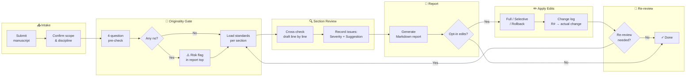

# Paper Revision (sci-writestructure)

> Diagnose and revise academic manuscript drafts section by section — based on IMRAD structure and universal SCI writing standards.

---

## Overview

`sci-writestructure` is a Hermes Agent skill that reviews SCI manuscript drafts against a structured checklist, then produces a severity-ranked revision report with ready-to-use sentence suggestions.

**What it does:**

- Runs a 4-question originality gate before detailed review
- Checks all 10 paper sections (Title → References) against journal-grade standards
- Produces a Markdown review report with ranked issues and actionable suggestions
- Applies edits only after user confirmation

**What it covers:**

STEM / Humanities / Medicine / Agriculture / Economics — language-agnostic, works for both Chinese and English drafts.

---

## Workflow



**Step summary**

| Step | Action | Deliverable |
|------|--------|-------------|
| 0 — Intake | Confirm manuscript, scope, discipline | — |
| 1 — Originality Gate | 4-question pre-check (non-blocking) | Risk flag if any no |
| 2 — Section Review | Load standards per section; cross-check draft | Issue list with severity + suggestion |
| 3 — Report | Generate structured Markdown report | `# Manuscript Review Report` |
| 4 — Apply Edits | Modify original or produce revised version | Change log (R# → actual change) |
| 5 — Re-review (opt-in) | Verify corrections | Updated report or end |

---

## Quick Start

**In Hermes Agent:**

```
@sci-writestructure  review my manuscript at D:/path/to/draft.docx
```

Or paste text directly:

```
@sci-writestructure  here is my Discussion section — please review
```

The agent will automatically trigger the full workflow.

---

## File Structure

```
SKILL.md                       ← Main workflow + execution rules
references/
  paper-criteria.md            ← Originality gate + per-section principles
  sci-writing-standard.md      ← Per-section recipes (word counts, pitfalls)
  phrase-bank.md               ← English sentence skeletons by section & function
  discipline-templates.md      ← Non-life-science M&M and metric phrasing
```

---

## Key Design Decisions

- **Non-blocking gate**: originality check flags risk but never blocks revision
- **On-demand loading**: reference files are `grep`-loaded per section; never loaded wholesale
- **Severity-driven**: High → Medium → Low; each issue gets a ready-to-use sentence suggestion
- **No verbatim template copying**: variables always come from the author's manuscript
- **Opt-in edits**: never modify the user's file without explicit confirmation

---

## License

MIT — use, modify, and distribute freely.